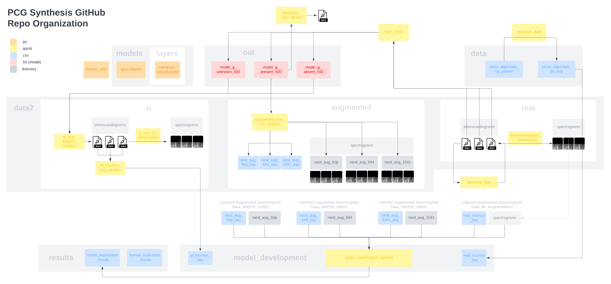

# PCG-synthesis

Aim: Synthesize stethoscope audio samples, or phonocardiograms (PCGs), using GANs. Use synthetic PCGs containing heart murmurs to augment minority classes in current PCG datasets and see if that improves murmur classifier performance for a given model.

Code: Training the GANs and evaluating the effect of synthetic PCGs on murmur classifiers.

Repo is organized according to this schema:

Contributors:
> Daniel Chung
